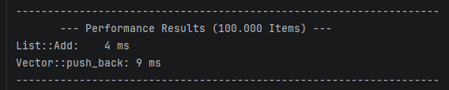
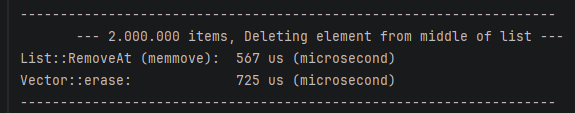

# Dynamic Integer List in C++
    A high-performance, dynamic integer list implementation in C++ that manages memory efficiently. 
    This project demonstrates core data structure concepts, including dynamic resizing, memory-efficient element removal.
# BenchMark Tests between Vector and this type
|         Adding 1.000.000 items         | 2.000.000 items,Deleting element from middle of list |    
|:--------------------------------------:|:----------------------------------------------------:|
|  |                |
